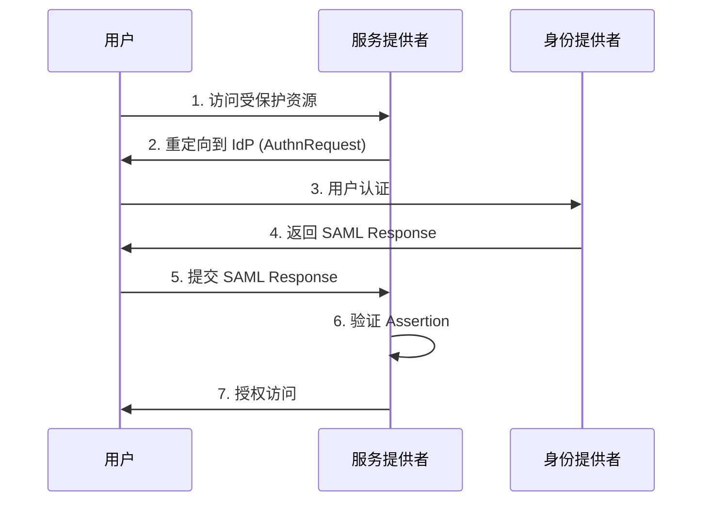
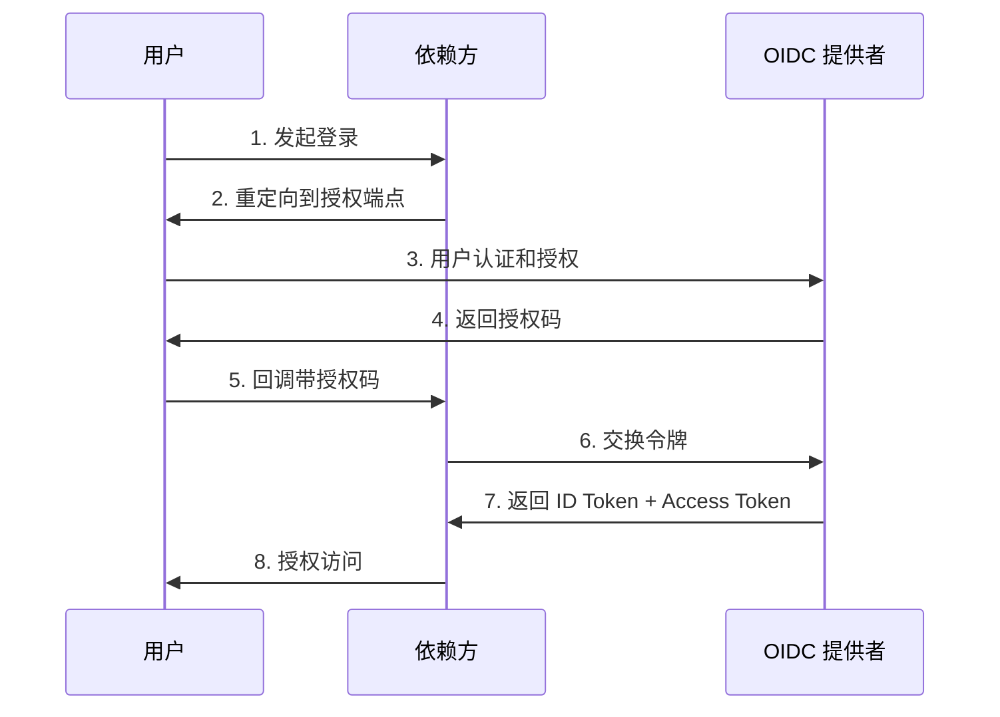

# SAML vs OIDC 协议对比详解

## 📋 概述

本文档详细对比 SAML (Security Assertion Markup Language) 和 OIDC (OpenID Connect) 两种身份验证协议，帮助你选择适合项目需求的认证方案。

## 🏗️ 基本架构差异

### SAML 架构
```
用户 (Principal)
    ↓ [认证请求]
身份提供者 (Identity Provider - IdP)
    ↓ [SAML Assertion]
服务提供者 (Service Provider - SP)
```

### OIDC 架构
```
用户 (End User)
    ↓ [授权请求]
OIDC 提供者 (OpenID Provider - OP)
    ↓ [ID Token + Access Token]
依赖方 (Relying Party - RP)
```

## 📊 技术对比表

| 特性 | SAML | OIDC |
|------|------|------|
| **协议基础** | XML | JSON/JWT |
| **传输方式** | HTTP POST/Redirect | HTTP + REST API |
| **令牌格式** | XML Assertions | JSON Web Tokens |
| **复杂度** | 高 | 中等 |
| **移动端支持** | 较差 | 优秀 |
| **API 集成** | 复杂 | 简单 |
| **学习曲线** | 陡峭 | 平缓 |
| **企业采用** | 广泛 | 快速增长 |

## 🔍 数据格式对比

### SAML - XML 格式
```xml
<saml2:Assertion 
    xmlns:saml2="urn:oasis:names:tc:SAML:2.0:assertion"
    ID="_8e8dc5f69a98cc4c1ff3427e5ce34606fd672f91e6"
    Version="2.0">
  <saml2:Subject>
    <saml2:NameID Format="urn:oasis:names:tc:SAML:2.0:nameid-format:persistent">
      user@example.com
    </saml2:NameID>
  </saml2:Subject>
  <saml2:AttributeStatement>
    <saml2:Attribute Name="email">
      <saml2:AttributeValue>user@example.com</saml2:AttributeValue>
    </saml2:Attribute>
    <saml2:Attribute Name="role">
      <saml2:AttributeValue>admin</saml2:AttributeValue>
    </saml2:Attribute>
  </saml2:AttributeStatement>
</saml2:Assertion>
```

### OIDC - JWT 格式
```json
{
  "header": {
    "alg": "RS256",
    "typ": "JWT",
    "kid": "key-id"
  },
  "payload": {
    "iss": "https://auth.example.com",
    "sub": "user-id-123",
    "aud": "client-id",
    "exp": 1642681200,
    "iat": 1642677600,
    "email": "user@example.com",
    "email_verified": true,
    "name": "John Doe",
    "role": "admin"
  }
}
```

## 🔄 认证流程对比

### SAML SSO 流程


### OIDC 授权码流程


## 🎯 使用场景建议

### 选择 SAML 的场景
- ✅ 大型企业环境
- ✅ 需要与现有 SAML 基础设施集成
- ✅ 严格的企业安全要求
- ✅ 主要是 Web 应用
- ✅ 复杂的属性映射需求

**代码示例 - SAML SP 配置**:
```javascript
const saml = require('passport-saml');

const samlConfig = {
  entryPoint: 'https://idp.example.com/sso',
  issuer: 'https://sp.example.com',
  callbackUrl: 'https://sp.example.com/saml/callback',
  cert: fs.readFileSync('idp-cert.pem', 'utf8'),
  privateCert: fs.readFileSync('sp-private.pem', 'utf8'),
  identifierFormat: 'urn:oasis:names:tc:SAML:2.0:nameid-format:persistent'
};
```

### 选择 OIDC 的场景
- ✅ 现代 Web 和移动应用
- ✅ API 驱动的架构
- ✅ 微服务环境
- ✅ 需要快速开发和部署
- ✅ 多平台支持需求

**代码示例 - OIDC RP 配置**:
```javascript
const { Issuer, Strategy } = require('openid-client');

const oidcConfig = {
  client_id: 'your-client-id',
  client_secret: 'your-client-secret',
  redirect_uris: ['https://app.example.com/callback'],
  response_types: ['code'],
  grant_types: ['authorization_code'],
  scope: 'openid profile email'
};
```

## 🔒 安全性对比

| 安全特性 | SAML | OIDC |
|----------|------|------|
| **签名机制** | XML Digital Signature | JWT Signature (JWS) |
| **加密支持** | XML Encryption | JWE (可选) |
| **防重放攻击** | Conditions + NotBefore/NotOnOrAfter | exp + iat claims |
| **传输安全** | HTTPS + POST Binding | HTTPS + PKCE |
| **会话管理** | SAML SLO | OIDC Session Management |

## ⚡ 性能对比

### 传输效率
- **SAML**: XML 格式较冗长，传输开销大
- **OIDC**: JSON 格式紧凑，传输效率高

### 解析性能
- **SAML**: XML 解析相对较慢
- **OIDC**: JSON 解析快速

### 缓存友好性
- **SAML**: XML 结构复杂，缓存效果一般
- **OIDC**: JWT 结构简单，易于缓存

## 🔧 实现复杂度

### 开发复杂度
```
SAML 实现复杂度: ████████░░ (8/10)
- XML 处理复杂
- 证书管理复杂
- 协议理解门槛高

OIDC 实现复杂度: ████░░░░░░ (4/10)
- JSON/JWT 处理简单
- REST API 友好
- 丰富的客户端库
```

### 运维复杂度
```
SAML 运维复杂度: ███████░░░ (7/10)
- 证书轮换复杂
- 调试困难
- 配置繁琐

OIDC 运维复杂度: ███░░░░░░░ (3/10)
- 密钥管理相对简单
- 调试工具丰富
- 配置直观
```

## 🚀 迁移建议

### 从 SAML 迁移到 OIDC
1. **评估现有集成**
   - 盘点当前 SAML 集成数量
   - 识别迁移优先级

2. **混合部署阶段**
   ```
   Phase 1: 新应用使用 OIDC
   Phase 2: 现有应用逐步迁移
   Phase 3: 完全迁移到 OIDC
   ```

3. **数据映射**
   ```javascript
   // SAML 属性到 OIDC Claims 映射
   const attributeMapping = {
     'http://schemas.xmlsoap.org/ws/2005/05/identity/claims/emailaddress': 'email',
     'http://schemas.xmlsoap.org/ws/2005/05/identity/claims/name': 'name',
     'http://schemas.microsoft.com/ws/2008/06/identity/claims/role': 'roles'
   };
   ```

## 📚 相关资源

### 官方规范
- [SAML 2.0 规范](https://docs.oasis-open.org/security/saml/v2.0/)
- [OIDC 核心规范](https://openid.net/specs/openid-connect-core-1_0.html)

### 实用工具
- [SAML 调试工具](https://www.samltool.com/)
- [JWT 调试工具](https://jwt.io/)
- [OIDC 调试工具](https://oidcdebugger.com/)

### 相关文档
- [OIDC 多租户架构设计](./oidc-multitenant.md)
- [系统整体架构](./system-overview.md)

---

> **结论**: 对于新项目，建议优先考虑 OIDC，特别是在多平台、API 驱动的现代应用场景中。对于现有的 SAML 环境，可以考虑渐进式迁移策略。 