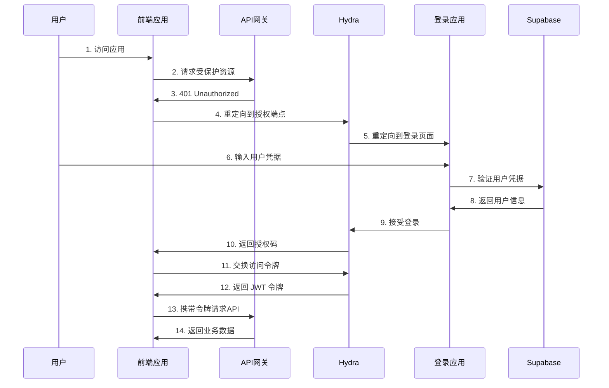
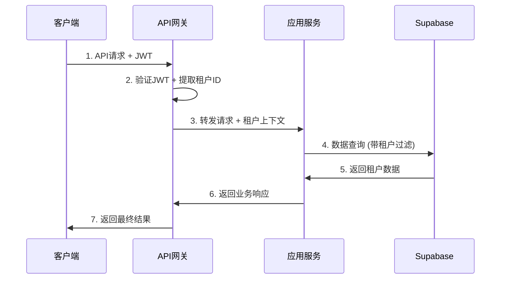

# 系统整体架构

## 📋 概述

本文档详细介绍 Hydra-Supabase 集成身份验证系统的整体架构设计，包括各组件的职责、交互流程和技术选型。

## 🏗️ 整体架构图

```
┌─────────────────────────────────────────────────────────────────────────────┐
│                              整体系统架构                                    │
└─────────────────────────────────────────────────────────────────────────────┘

                        ┌─────────────────┐
                        │   前端应用群     │
                        │  (React/Vue)    │
                        └─────────────────┘
                                │
                                ▼
                    ┌─────────────────────────┐
                    │      负载均衡器          │
                    │    (Nginx/ALB)         │
                    └─────────────────────────┘
                                │
                ┌───────────────┼───────────────┐
                ▼               ▼               ▼
    ┌─────────────────┐ ┌─────────────────┐ ┌─────────────────┐
    │   应用服务器 A   │ │   应用服务器 B   │ │   应用服务器 C   │
    │ (Express.js)    │ │ (Express.js)    │ │ (Express.js)    │
    └─────────────────┘ └─────────────────┘ └─────────────────┘
                │               │               │
                └───────────────┼───────────────┘
                                ▼
                    ┌─────────────────────────┐
                    │      身份认证层         │
                    │   (Hydra OIDC)         │
                    └─────────────────────────┘
                                │
                ┌───────────────┼───────────────┐
                ▼               ▼               ▼
    ┌─────────────────┐ ┌─────────────────┐ ┌─────────────────┐
    │  Supabase A     │ │  Supabase B     │ │  Supabase C     │
    │ (Tenant A)      │ │ (Tenant B)      │ │ (Tenant C)      │
    └─────────────────┘ └─────────────────┘ └─────────────────┘
```

## 🧩 核心组件

### 1. 身份认证层 (Identity Layer)

#### Ory Hydra
- **职责**: OAuth2/OIDC 授权服务器
- **端口**: 4444 (Public), 4445 (Admin)
- **特性**:
  - JWT 签名和验证
  - 多客户端管理
  - 授权码流程
  - 刷新令牌管理

```yaml
# Hydra 核心配置
serve:
  public:
    port: 4444
    base_url: https://auth.example.com
  admin:
    port: 4445
    
oauth2:
  access_token_strategy: jwt
  expose_internal_errors: false
  
urls:
  login: https://login.example.com/login
  consent: https://login.example.com/consent
  logout: https://login.example.com/logout
```

#### 登录同意应用 (Login & Consent App)
- **职责**: 用户认证界面和授权同意
- **技术栈**: Node.js + Express + EJS
- **特性**:
  - 用户登录验证
  - 授权同意界面
  - 多因子认证支持
  - 品牌定制

### 2. 数据存储层 (Data Layer)

#### Supabase 集群
- **职责**: 业务数据存储和管理
- **特性**:
  - 多租户数据隔离
  - 行级安全策略 (RLS)
  - 实时数据同步
  - 自动备份

```sql
-- 多租户数据隔离策略
CREATE POLICY "tenant_isolation" ON users
FOR ALL USING (tenant_id = current_setting('app.tenant_id')::uuid);

-- 用户数据表结构
CREATE TABLE users (
  id UUID PRIMARY KEY DEFAULT gen_random_uuid(),
  tenant_id UUID NOT NULL,
  email VARCHAR(255) UNIQUE NOT NULL,
  encrypted_password VARCHAR(255),
  metadata JSONB DEFAULT '{}',
  created_at TIMESTAMPTZ DEFAULT NOW()
);
```

### 3. 应用服务层 (Application Layer)

#### API 网关
- **职责**: 请求路由、认证、限流
- **技术**: Kong/Envoy/自定义
- **特性**:
  - JWT 验证
  - 租户路由
  - API 限流
  - 监控埋点

#### 业务服务
- **架构**: 微服务架构
- **通信**: RESTful API + GraphQL
- **认证**: JWT Bearer Token

### 4. 前端应用层 (Frontend Layer)

#### Web 应用
```javascript
// 前端认证配置
const authConfig = {
  authority: 'https://auth.example.com',
  client_id: 'frontend-client',
  redirect_uri: window.location.origin + '/callback',
  response_type: 'code',
  scope: 'openid profile email',
  post_logout_redirect_uri: window.location.origin
};
```

#### 移动应用
- **技术**: React Native / Flutter
- **认证**: PKCE + Authorization Code Flow
- **存储**: 安全存储 (Keychain/Keystore)

## 🔄 数据流转

### 1. 用户认证流程



### 2. 多租户数据访问



## 🔐 安全架构

### 1. 安全边界

```
┌─────────────────────────────────────────────────────────────┐
│                        安全边界图                             │
└─────────────────────────────────────────────────────────────┘

Internet ──► WAF ──► Load Balancer ──► API Gateway ──► Services
           │        │              │             │
           │        │              │             ▼
           │        │              │    ┌─────────────────┐
           │        │              │    │   JWT Verify    │
           │        │              │    │   Rate Limit    │
           │        │              │    │   Tenant Route  │
           │        │              │    └─────────────────┘
           │        │              │
           │        │              ▼
           │        │    ┌─────────────────┐
           │        │    │  OIDC Provider  │
           │        │    │    (Hydra)      │
           │        │    └─────────────────┘
           │        │
           │        ▼
           │  ┌─────────────────┐
           │  │   TLS Termination│
           │  │   CORS Policy   │
           │  └─────────────────┘
           │
           ▼
    ┌─────────────────┐
    │  DDoS Protection │
    │  IP Filtering   │
    └─────────────────┘
```

### 2. 密钥管理

```javascript
// 密钥轮换策略
class KeyManager {
  constructor() {
    this.keys = new Map();
    this.rotationInterval = 24 * 60 * 60 * 1000; // 24小时
  }

  async rotateKeys() {
    // 生成新密钥
    const newKey = await this.generateKey();
    
    // 保留旧密钥一段时间以验证现有令牌
    const oldKeys = Array.from(this.keys.values());
    this.keys.set(newKey.kid, newKey);
    
    // 清理过期密钥
    setTimeout(() => {
      oldKeys.forEach(key => this.keys.delete(key.kid));
    }, this.rotationInterval);
  }
}
```

## 📊 监控和可观测性

### 1. 监控指标

#### 业务指标
- 用户登录成功/失败率
- API 响应时间
- 租户活跃度
- 错误率统计

#### 技术指标
- 系统资源使用率
- 数据库连接池状态
- 缓存命中率
- 网络延迟

### 2. 日志架构

```
应用日志 ──► Fluentd ──► Elasticsearch ──► Kibana
         │
系统日志 ──┤
         │
审计日志 ──┘
```

### 3. 告警策略

```yaml
# 告警配置示例
alerts:
  - name: high_error_rate
    condition: error_rate > 5%
    duration: 5m
    action: slack_notification
    
  - name: jwt_verification_failure
    condition: jwt_errors > 10/min
    duration: 1m
    action: email_notification
    
  - name: database_connection_failure
    condition: db_connections_failed > 0
    duration: 30s
    action: pager_duty
```

## 🚀 部署架构

### 1. 容器化部署

```yaml
# docker-compose.yml
version: '3.8'
services:
  hydra:
    image: oryd/hydra:v1.11.8
    environment:
      - DSN=postgres://...
    deploy:
      replicas: 3
      
  app:
    build: .
    environment:
      - NODE_ENV=production
    deploy:
      replicas: 5
      
  nginx:
    image: nginx:alpine
    volumes:
      - ./nginx.conf:/etc/nginx/nginx.conf
    deploy:
      replicas: 2
```

### 2. Kubernetes 部署

```yaml
# k8s-deployment.yaml
apiVersion: apps/v1
kind: Deployment
metadata:
  name: hydra-deployment
spec:
  replicas: 3
  selector:
    matchLabels:
      app: hydra
  template:
    metadata:
      labels:
        app: hydra
    spec:
      containers:
      - name: hydra
        image: oryd/hydra:v1.11.8
        ports:
        - containerPort: 4444
        - containerPort: 4445
        env:
        - name: DSN
          valueFrom:
            secretKeyRef:
              name: hydra-secret
              key: dsn
```

## 🔧 扩展性设计

### 1. 水平扩展

- **无状态服务**: 所有应用服务设计为无状态
- **负载均衡**: 支持动态扩缩容
- **数据库分片**: 按租户进行数据分片

### 2. 垂直扩展

- **资源监控**: 自动调整资源配额
- **性能优化**: 代码和查询优化
- **缓存策略**: 多级缓存架构

## 📚 相关文档

- [OIDC 多租户架构设计](./oidc-multitenant.md)
- [SAML vs OIDC 协议对比](./protocols-comparison.md)
- [部署指南](../deployment/production.md)
- [安全最佳实践](../security/best-practices.md)

---

> **总结**: 该架构采用微服务和多租户设计，具备高可用、高安全性和良好的扩展性。通过标准化的 OIDC 协议和现代化的技术栈，可以满足大多数企业级应用的身份认证需求。 