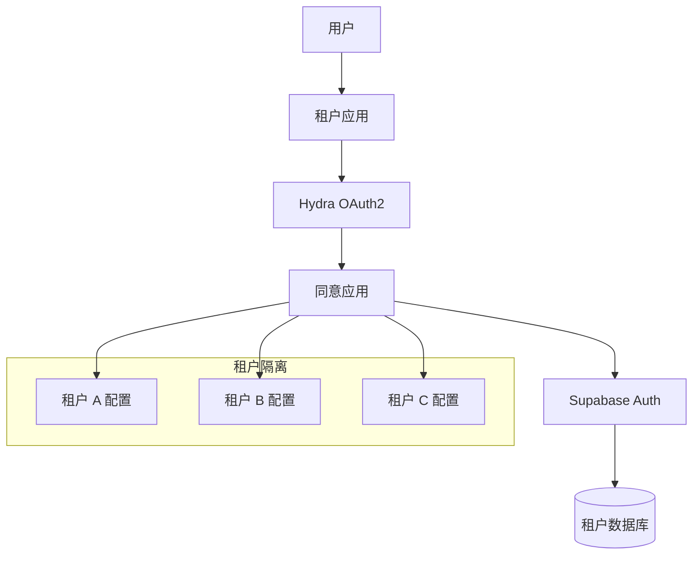

# OIDC 多租户架构设计指南

## 1. 多租户模式对比

### 模式 A: 单一 OIDC 提供者 + 租户隔离
```
┌─────────────────────────────────────────┐
│          Single OIDC Provider           │
├─────────────────────────────────────────┤
│  Tenant A    │  Tenant B    │  Tenant C │
│  Client      │  Client      │  Client   │
│  ┌─────────┐ │  ┌─────────┐ │  ┌──────┐ │
│  │ App A   │ │  │ App B   │ │  │ App C│ │
│  └─────────┘ │  └─────────┘ │  └──────┘ │
└─────────────────────────────────────────┘
```

**优势**:
- 统一身份管理
- 简化运维
- 成本效益高
- 跨租户 SSO 可能

**劣势**:
- 租户品牌定制有限
- 安全隔离相对较弱

### 模式 B: 每租户独立 OIDC 提供者
```
┌─────────────┐  ┌─────────────┐  ┌─────────────┐
│  Tenant A   │  │  Tenant B   │  │  Tenant C   │
│    OIDC     │  │    OIDC     │  │    OIDC     │
│  Provider   │  │  Provider   │  │  Provider   │
├─────────────┤  ├─────────────┤  ├─────────────┤
│   App A     │  │   App B     │  │   App C     │
└─────────────┘  └─────────────┘  └─────────────┘
```

**优势**:
- 完全隔离
- 独立品牌
- 自定义配置
- 独立的安全策略

**劣势**:
- 运维复杂
- 成本较高
- 无跨租户 SSO

### 模式 C: 混合模式 (推荐)
```
┌─────────────────────────────────────────┐
│         Centralized Auth Hub            │
├─────────────────────────────────────────┤
│  ┌─────────────┐  ┌─────────────┐      │
│  │  Tenant A   │  │  Tenant B   │  ... │
│  │   Config    │  │   Config    │      │
│  └─────────────┘  └─────────────┘      │
├─────────────────────────────────────────┤
│            Shared Services              │
│  • User Management                      │
│  • Token Validation                     │
│  • Audit & Compliance                   │
└─────────────────────────────────────────┘
```

## 2. Hydra + Supabase 多租户实现

### 架构设计


### 租户识别策略

#### 方式 1: 子域名识别
```javascript
// tenant-a.example.com
// tenant-b.example.com
function getTenantFromDomain(req) {
  const hostname = req.get('host');
  const subdomain = hostname.split('.')[0];
  return subdomain !== 'www' ? subdomain : null;
}
```

#### 方式 2: 路径识别
```javascript
// example.com/tenant-a/app
// example.com/tenant-b/app
function getTenantFromPath(req) {
  const pathSegments = req.path.split('/');
  return pathSegments[1]; // 假设租户 ID 在第一个路径段
}
```

#### 方式 3: 头部识别
```javascript
// X-Tenant-ID: tenant-a
function getTenantFromHeader(req) {
  return req.get('X-Tenant-ID');
}
```

### 动态客户端注册
```javascript
// 动态为租户创建 OIDC 客户端
async function createTenantClient(tenantId, tenantConfig) {
  const clientConfig = {
    client_id: `tenant-${tenantId}`,
    client_name: `${tenantConfig.name} Application`,
    client_secret: generateSecureSecret(),
    grant_types: ['authorization_code', 'refresh_token'],
    response_types: ['code'],
    scope: tenantConfig.allowed_scopes.join(' '),
    redirect_uris: [
      `https://${tenantId}.example.com/auth/callback`,
      `https://example.com/${tenantId}/auth/callback`
    ],
    post_logout_redirect_uris: [
      `https://${tenantId}.example.com/logout`,
      `https://example.com/${tenantId}/logout`
    ],
    // 租户特定配置
    metadata: {
      tenant_id: tenantId,
      tenant_domain: tenantConfig.domain,
      allowed_features: tenantConfig.features
    }
  };

  // 使用 Hydra Admin API 创建客户端
  const response = await fetch(`${HYDRA_ADMIN_URL}/clients`, {
    method: 'POST',
    headers: { 'Content-Type': 'application/json' },
    body: JSON.stringify(clientConfig)
  });

  return response.json();
}
```

## 3. 租户数据隔离

### Supabase RLS 多租户策略
```sql
-- 创建租户感知的 RLS 策略
CREATE POLICY "租户数据隔离" ON public.profiles
  FOR ALL TO authenticated
  USING (
    -- 从 JWT 中提取租户 ID
    (auth.jwt() ->> 'tenant_id') = tenant_id
  )
  WITH CHECK (
    (auth.jwt() ->> 'tenant_id') = tenant_id
  );

-- 为每个表创建租户字段
ALTER TABLE public.profiles ADD COLUMN tenant_id TEXT NOT NULL;
ALTER TABLE public.user_roles ADD COLUMN tenant_id TEXT NOT NULL;
ALTER TABLE public.user_permissions ADD COLUMN tenant_id TEXT NOT NULL;

-- 创建租户管理表
CREATE TABLE public.tenants (
  id TEXT PRIMARY KEY,
  name TEXT NOT NULL,
  domain TEXT UNIQUE,
  settings JSONB DEFAULT '{}',
  active BOOLEAN DEFAULT true,
  created_at TIMESTAMPTZ DEFAULT NOW(),
  updated_at TIMESTAMPTZ DEFAULT NOW()
);

-- 租户配置示例
INSERT INTO public.tenants (id, name, domain, settings) VALUES
('tenant-a', 'Company A', 'tenant-a.example.com', '{
  "branding": {
    "logo_url": "https://cdn.example.com/tenant-a/logo.png",
    "primary_color": "#007bff",
    "theme": "light"
  },
  "features": ["sso", "api_access", "custom_fields"],
  "limits": {
    "max_users": 1000,
    "api_calls_per_day": 10000
  }
}'),
('tenant-b', 'Company B', 'tenant-b.example.com', '{
  "branding": {
    "logo_url": "https://cdn.example.com/tenant-b/logo.png", 
    "primary_color": "#28a745",
    "theme": "dark"
  },
  "features": ["sso"],
  "limits": {
    "max_users": 100,
    "api_calls_per_day": 1000
  }
}');
```

### 增强的 Auth Hook 支持多租户
```sql
-- 更新 custom_access_token_hook 支持租户
CREATE OR REPLACE FUNCTION public.custom_access_token_hook(event jsonb)
RETURNS jsonb
LANGUAGE plpgsql
STABLE
AS $$
DECLARE
  claims jsonb;
  user_id uuid;
  user_email text;
  tenant_id text;
  tenant_config jsonb;
  user_roles text[];
  user_permissions text[];
BEGIN
  user_id := (event->>'user_id')::uuid;
  user_email := event->>'user_email';
  claims := event->'claims';
  
  -- 从用户配置文件获取租户 ID
  SELECT p.tenant_id INTO tenant_id
  FROM public.profiles p
  WHERE p.id = user_id::text;
  
  -- 获取租户配置
  SELECT t.settings INTO tenant_config
  FROM public.tenants t
  WHERE t.id = tenant_id AND t.active = true;
  
  -- 获取租户内的用户角色
  SELECT ARRAY_AGG(DISTINCT role) INTO user_roles
  FROM public.user_roles 
  WHERE user_id = (event->>'user_id')::uuid 
    AND tenant_id = tenant_id
    AND active = true;
  
  -- 获取租户内的用户权限  
  SELECT ARRAY_AGG(DISTINCT scope) INTO user_permissions
  FROM public.user_permissions 
  WHERE email = user_email
    AND tenant_id = tenant_id
    AND active = true;
  
  -- 设置默认值
  user_roles := COALESCE(user_roles, ARRAY['user']);
  user_permissions := COALESCE(user_permissions, ARRAY['openid', 'profile', 'email']);
  
  -- 添加租户相关声明
  claims := claims || jsonb_build_object(
    'role', 'authenticated',
    'tenant_id', tenant_id,
    'tenant_features', COALESCE(tenant_config->'features', '[]'::jsonb),
    'user_roles', user_roles,
    'permissions', user_permissions,
    'provider', 'hydra-oidc'
  );
  
  -- 更新事件
  event := jsonb_set(event, '{claims}', claims);
  
  RETURN event;
END;
$$;
```

## 4. 前端多租户处理

### React 应用示例
```javascript
// TenantProvider.js
import { createContext, useContext, useEffect, useState } from 'react';
import { createClient } from '@supabase/supabase-js';

const TenantContext = createContext();

export function TenantProvider({ children }) {
  const [tenant, setTenant] = useState(null);
  const [supabase, setSupabase] = useState(null);
  
  useEffect(() => {
    // 从域名或路径识别租户
    const tenantId = getTenantFromLocation();
    
    if (tenantId) {
      // 获取租户配置
      fetchTenantConfig(tenantId).then(config => {
        setTenant(config);
        
        // 创建租户特定的 Supabase 客户端
        const client = createClient(
          config.supabase_url,
          config.supabase_anon_key,
          {
            // 自定义头部包含租户信息
            global: {
              headers: {
                'X-Tenant-ID': tenantId
              }
            }
          }
        );
        
        setSupabase(client);
      });
    }
  }, []);
  
  return (
    <TenantContext.Provider value={{ tenant, supabase }}>
      {children}
    </TenantContext.Provider>
  );
}

export const useTenant = () => useContext(TenantContext);

// 使用示例
function LoginPage() {
  const { tenant, supabase } = useTenant();
  
  const handleOIDCLogin = async () => {
    if (!supabase || !tenant) return;
    
    const { data, error } = await supabase.auth.signInWithOAuth({
      provider: 'hydra',
      options: {
        redirectTo: `https://${tenant.domain}/auth/callback`,
        queryParams: {
          // 传递租户信息
          tenant_id: tenant.id,
          client_id: tenant.oidc_client_id
        }
      }
    });
  };
  
  return (
    <div style={{ 
      backgroundColor: tenant?.branding?.primary_color,
      // 应用租户主题
    }}>
      
      <button onClick={handleOIDCLogin}>
        Login with {tenant?.name}
      </button>
    </div>
  );
}
```

## 5. 运维和监控

### 租户级别的监控
```javascript
// 租户使用情况统计
const getTenantMetrics = async (tenantId, dateRange) => {
  const { data, error } = await supabase
    .from('login_events')
    .select('*')
    .eq('tenant_id', tenantId)
    .gte('login_at', dateRange.start)
    .lte('login_at', dateRange.end);
    
  return {
    total_logins: data.length,
    unique_users: [...new Set(data.map(e => e.user_id))].length,
    success_rate: data.filter(e => e.success).length / data.length
  };
};

// 租户资源使用限制
const checkTenantLimits = async (tenantId) => {
  const tenant = await getTenantConfig(tenantId);
  const usage = await getTenantUsage(tenantId);
  
  return {
    users: {
      current: usage.user_count,
      limit: tenant.limits.max_users,
      exceeded: usage.user_count > tenant.limits.max_users
    },
    api_calls: {
      today: usage.api_calls_today,
      limit: tenant.limits.api_calls_per_day,
      exceeded: usage.api_calls_today > tenant.limits.api_calls_per_day
    }
  };
};
```

## 6. 安全考虑

### 租户间隔离验证
```sql
-- 创建函数验证跨租户访问
CREATE OR REPLACE FUNCTION public.validate_tenant_access(
  target_tenant_id text,
  required_permission text DEFAULT NULL
)
RETURNS boolean
LANGUAGE plpgsql
STABLE
SECURITY DEFINER
AS $$
DECLARE
  current_tenant_id text;
  has_permission boolean := false;
BEGIN
  -- 从 JWT 获取当前用户的租户 ID
  current_tenant_id := auth.jwt() ->> 'tenant_id';
  
  -- 检查是否访问同一租户
  IF current_tenant_id != target_tenant_id THEN
    -- 检查是否有跨租户权限（超级管理员）
    SELECT EXISTS (
      SELECT 1 FROM public.user_roles 
      WHERE user_id = auth.uid()
        AND role = 'super_admin'
        AND active = true
    ) INTO has_permission;
    
    RETURN has_permission;
  END IF;
  
  -- 检查特定权限（如果指定）
  IF required_permission IS NOT NULL THEN
    SELECT public.has_permission(required_permission) INTO has_permission;
    RETURN has_permission;
  END IF;
  
  RETURN true;
END;
$$;

-- 在 RLS 策略中使用
CREATE POLICY "严格租户隔离" ON public.sensitive_data
  FOR ALL TO authenticated
  USING (
    validate_tenant_access(tenant_id, 'read_sensitive_data')
  );
```

## 总结

**OIDC 在多租户场景下的优势：**

✅ **灵活性高**: 支持多种租户识别和隔离策略
✅ **开发效率**: JSON 格式易于处理和定制
✅ **成本效益**: 单一基础设施支持多租户
✅ **可扩展性**: 动态客户端注册和配置
✅ **现代化**: 原生支持 SPA 和移动应用
✅ **安全性**: 通过 JWT claims 实现细粒度权限控制

**相比 SAML 的优势:**
- 更容易实现动态配置
- 前端集成更简单
- API 友好
- 移动应用支持更好

**适用的多租户场景:**
- SaaS 应用平台
- 企业服务集成
- API 即服务 (APIaaS)
- 白标解决方案
- 混合云身份管理

对于我们的 Hydra + Supabase 架构，OIDC 是多租户场景的理想选择！ 