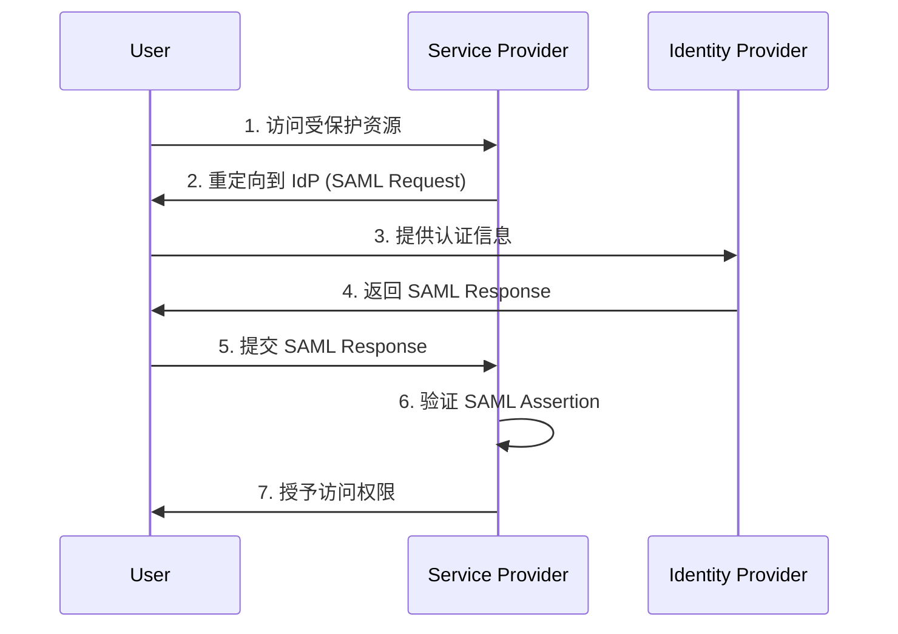
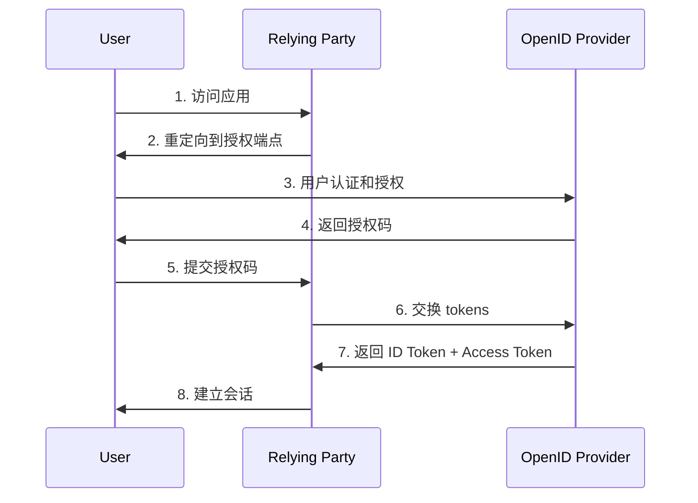

# SAML vs OIDC 协议对比详解

## 1. 基本架构差异

### SAML 架构
```
用户 (Principal)
    ↓
身份提供者 (Identity Provider - IdP)
    ↓ [SAML Assertion]
服务提供者 (Service Provider - SP)
```

### OIDC 架构
```
用户 (End User)
    ↓
OIDC 提供者 (OpenID Provider - OP)
    ↓ [ID Token + Access Token]
依赖方 (Relying Party - RP)
```

## 2. 数据格式对比

### SAML - XML 基础
```xml
<saml2:Assertion>
  <saml2:Subject>
    <saml2:NameID Format="urn:oasis:names:tc:SAML:2.0:nameid-format:persistent">
      user@example.com
    </saml2:NameID>
  </saml2:Subject>
  <saml2:AttributeStatement>
    <saml2:Attribute Name="email">
      <saml2:AttributeValue>user@example.com</saml2:AttributeValue>
    </saml2:Attribute>
    <saml2:Attribute Name="role">
      <saml2:AttributeValue>admin</saml2:AttributeValue>
    </saml2:Attribute>
  </saml2:AttributeStatement>
</saml2:Assertion>
```

### OIDC - JSON Web Token (JWT)
```json
{
  "sub": "user123",
  "email": "user@example.com",
  "name": "John Doe",
  "role": "admin",
  "iss": "https://auth.example.com",
  "aud": "my-app-client-id",
  "exp": 1640995200,
  "iat": 1640991600
}
```

## 3. 协议流程对比

### SAML SSO 流程 (SP-Initiated)


### OIDC Authorization Code 流程


## 4. 特性对比表

| 特性 | SAML | OIDC |
|------|------|------|
| **数据格式** | XML | JSON |
| **传输方式** | HTTP POST/Redirect | HTTP/REST API |
| **令牌类型** | SAML Assertion | JWT (ID Token) |
| **移动支持** | 复杂 | 原生支持 |
| **API 集成** | 困难 | 简单 |
| **学习曲线** | 陡峭 | 平缓 |
| **企业采用** | 广泛 | 快速增长 |
| **安全性** | 高 (XML 签名/加密) | 高 (JWT 签名) |
| **灵活性** | 较低 | 高 |
| **标准化** | 完全标准化 | 标准化但灵活 |

## 5. 使用场景对比

### SAML 适用场景
- ✅ 企业级 SSO 解决方案
- ✅ B2B 身份联合
- ✅ 遗留系统集成
- ✅ 需要复杂属性映射
- ✅ 严格的企业安全要求
- ✅ 多租户 SaaS 应用

### OIDC 适用场景
- ✅ 现代 Web 应用
- ✅ 移动应用认证
- ✅ API 授权访问
- ✅ 微服务架构
- ✅ 社交登录集成
- ✅ 开发者友好的应用

## 6. 安全特性对比

### SAML 安全特性
```xml
<!-- XML 数字签名 -->
<ds:Signature>
  <ds:SignedInfo>
    <ds:CanonicalizationMethod Algorithm="..."/>
    <ds:SignatureMethod Algorithm="..."/>
    <ds:Reference URI="#_assertion">
      <ds:DigestMethod Algorithm="..."/>
      <ds:DigestValue>...</ds:DigestValue>
    </ds:Reference>
  </ds:SignedInfo>
  <ds:SignatureValue>...</ds:SignatureValue>
</ds:Signature>

<!-- XML 加密 -->
<xenc:EncryptedData Type="...">
  <xenc:EncryptionMethod Algorithm="..."/>
  <xenc:CipherData>
    <xenc:CipherValue>...</xenc:CipherValue>
  </xenc:CipherData>
</xenc:EncryptedData>
```

### OIDC 安全特性
```javascript
// JWT 签名验证
const jwt = require('jsonwebtoken');
const publicKey = getPublicKey(header.kid);

try {
  const decoded = jwt.verify(token, publicKey, {
    algorithms: ['RS256'],
    issuer: 'https://auth.example.com',
    audience: 'my-app-client-id'
  });
  console.log('Token valid:', decoded);
} catch (error) {
  console.error('Token invalid:', error);
}

// PKCE (Proof Key for Code Exchange)
const codeVerifier = base64URLEncode(crypto.randomBytes(32));
const codeChallenge = base64URLEncode(
  crypto.createHash('sha256').update(codeVerifier).digest()
);
```

## 7. 错误处理对比

### SAML 错误响应
```xml
<saml2p:Response>
  <saml2p:Status>
    <saml2p:StatusCode Value="urn:oasis:names:tc:SAML:2.0:status:Requester">
      <saml2p:StatusCode Value="urn:oasis:names:tc:SAML:2.0:status:InvalidNameIDPolicy"/>
    </saml2p:StatusCode>
    <saml2p:StatusMessage>
      The NameID format is not supported
    </saml2p:StatusMessage>
  </saml2p:Status>
</saml2p:Response>
```

### OIDC 错误响应
```json
{
  "error": "invalid_request",
  "error_description": "The request is missing a required parameter: client_id",
  "error_uri": "https://tools.ietf.org/html/rfc6749#section-4.1.2.1"
}
```

## 8. 配置复杂度对比

### SAML 配置示例
```xml
<md:EntityDescriptor entityID="https://sp.example.com">
  <md:SPSSODescriptor 
    protocolSupportEnumeration="urn:oasis:names:tc:SAML:2.0:protocol">
    <md:KeyDescriptor use="signing">
      <ds:KeyInfo>
        <ds:X509Data>
          <ds:X509Certificate>MIIBkTCB+wIJANZ...</ds:X509Certificate>
        </ds:X509Data>
      </ds:KeyInfo>
    </md:KeyDescriptor>
    <md:AssertionConsumerService 
      Binding="urn:oasis:names:tc:SAML:2.0:bindings:HTTP-POST"
      Location="https://sp.example.com/acs" 
      index="0"/>
  </md:SPSSODescriptor>
</md:EntityDescriptor>
```

### OIDC 配置示例
```json
{
  "client_id": "my-app-client-id",
  "client_secret": "my-app-client-secret",
  "issuer": "https://auth.example.com",
  "authorization_endpoint": "https://auth.example.com/auth",
  "token_endpoint": "https://auth.example.com/token",
  "userinfo_endpoint": "https://auth.example.com/userinfo",
  "jwks_uri": "https://auth.example.com/.well-known/jwks.json",
  "scopes_supported": ["openid", "profile", "email"],
  "response_types_supported": ["code", "id_token", "token"]
}
```

## 9. 在我们项目中的应用

### 当前实现 (OIDC with Hydra)
- ✅ 现代化架构，适合 Web 和移动应用
- ✅ JSON 格式，易于解析和调试
- ✅ 与 Supabase Auth 集成良好
- ✅ 支持标准 OAuth 2.0 流程
- ✅ 开发者友好，社区支持好

### 如果使用 SAML 的考虑
- ⚠️ 需要额外的 SAML 处理库
- ⚠️ XML 解析复杂度高
- ⚠️ 与现代前端框架集成困难
- ⚠️ 移动应用支持复杂
- ✅ 企业级安全和合规要求
- ✅ 已有 SAML 基础设施的企业

## 10. 选择建议

### 选择 SAML 当你需要:
- 企业级 B2B 集成
- 复杂的属性映射和转换
- 与现有 SAML 基础设施集成
- 严格的安全和合规要求
- 多租户企业应用

### 选择 OIDC 当你需要:
- 现代 Web 或移动应用
- API 驱动的架构
- 快速开发和原型
- 与第三方服务集成
- 开发者友好的解决方案

## 11. 混合使用场景

```javascript
// 同时支持 SAML 和 OIDC 的身份提供者配置
const identityProviders = {
  oidc: {
    issuer: 'https://hydra.example.com',
    clientId: 'supabase-client',
    scopes: ['openid', 'profile', 'email']
  },
  saml: {
    entryPoint: 'https://saml-idp.example.com/sso',
    certificate: 'MIIBkTCB+wIJANZ...',
    identifierFormat: 'urn:oasis:names:tc:SAML:2.0:nameid-format:persistent'
  }
};

// 根据用户类型选择协议
function getAuthProvider(userType) {
  return userType === 'enterprise' ? 'saml' : 'oidc';
}
```

## 总结

**OIDC** 更适合现代应用开发，特别是我们当前的 Hydra + Supabase 架构，因为:
- 简单易用，开发效率高
- 原生支持 JSON 和 REST API
- 与现代前端框架集成良好
- 移动应用支持优秀
- 社区生态丰富

**SAML** 更适合企业级场景，特别是:
- 需要与现有企业身份系统集成
- 复杂的多租户 B2B 应用
- 严格的安全合规要求
- 已有 SAML 基础设施的组织 